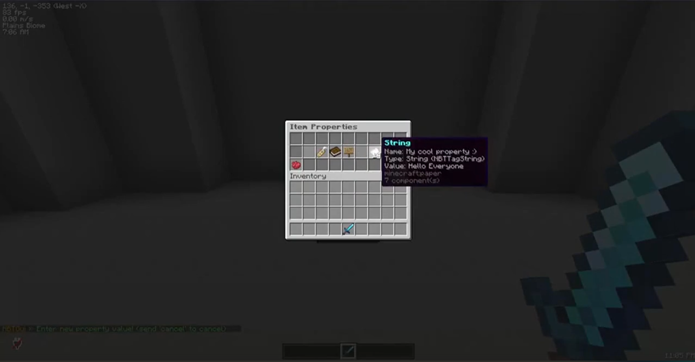

# NBTGui



NBTGui is a minecraft plugin that allows developers
and server owners to view and manage nbt properties easily,
directly in the game.

## Dependencies:

- NBTApi must be installed on the server

## Commands:

These commands require holding an item in hand:

- /nbtgui add <name\> <type\> <value\> - Adds a property to item in hand
- /nbtgui item - Opens the management gui

## Permissions:

- nbtgui.command.item
- nbtgui.command.add

# Future plans:

- Modifying values using gui or commands
- Removing values using gui or commands
- Configurability for everything

# Building:

```sh
git clone https://github.com/KaspianDev/NBTGui.git
```

```sh
./gradlew build
```

Artifact will be located in build/libs.
